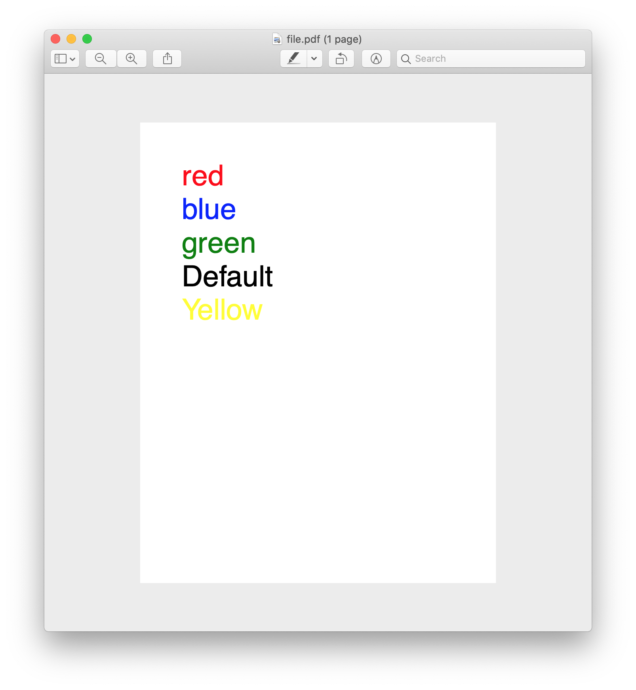

This is a demo on how to build a customer renderer for Vue.js 3. This one renders to a PDF using [PDFKit](https://pdfkit.org/). 

This is *not* for production use, but to demonstrate how you could create a non-standard custom renderer.

See [the blog post](https://lachlan-miller.me/articles/vue-3-pdf-customer-renderer) for a write-up on how to write a custom renderer, or the [article here](./ARTICLE.md).

`master` may not be in a working state; I am just hacking on this when I have time, adding features as I go. You can try it out by by installing the deps with `yarn` then run `yarn ts-node src` to generate the PDF, then `open file.pdf` to see the output.

Currently this:

```html
<View>
  <View :styles="{color: 'red'}">
    <Text>Red</Text>
    <Text :styles="{color: 'blue'}">Blue</Text>
    <Text :styles="{color: 'green'}">Green</Text>
  </View>
  <Text>Default</Text>
  <Text :styles="{color: 'yellow'}">Yellow</Text>
</View>
```

Renders this:



See `src/index.ts` for example usage.

## Supported Styles

A very limited subset of styles are supported. The goal is to make authoring a PDF Document a similar experience to author a web app with Vue.

| Rule  | Type | Example | Default |
| ------------- | ------------- |
| color | string | 'blue', 'red' | 'black' |
| fontSize  | integer  | 10, 15, 45 | 10 |
| align  | 'left' | 'right' | 'center'  | See type | 'left' | 
